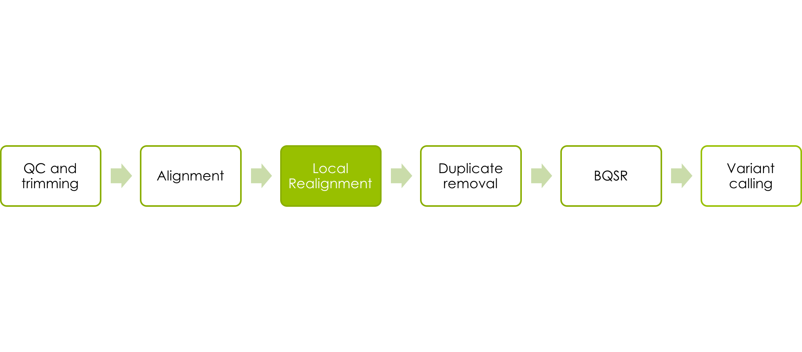
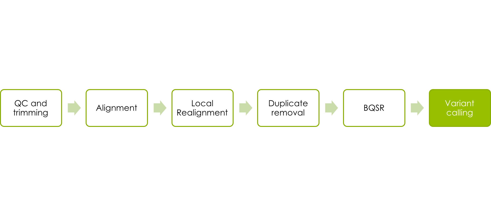

# NGS workflow

The data we will work with comes from the 1000 Genomes Project.
Because whole human genomes are time consuming to work with on account of their size, we will use only a small portion of the human genome. To be more precise it is about a megabase from chromosome 17.
Samtools has been used to extract this region of the data from the 1000 Genomes ftp site. It is a whole genome shotgun sequence from all of the individuals from the CEU (CEPH Europeans from Utah) population whose samples had low coverage (2-4x average).
<!-- We have 81 low coverage Illumina sequences, 63 Illumina exomes and 15 low coverage 454 samples.
55 of the samples exist in more than one datatype. -->

Much like the corresponding lecture, we will go through alignment, deduplication, base quality score recalibration, variant calling and variant filtering.

But first, lets book a node and set up the programs that we will be using.

## Book your own node

We have reserved half a node for each student during this course.
By now, you are probably already familiar with the procedure:

```bash
salloc -A g2017019 -t 04:00:00 -p core -n 8 --no-shell --reservation=g2017019_3 &
```

Make sure you only do this once, otherwise other course participants will have a hard time booking theirs!
Once your job allocation has been granted you can connect to the node using ssh, just like in the [Uppmax Introduction exercise](uppmax-intro) yesterday.

I.e. Use

```bash
squeue -u <username>
```

to find out the name of your node, and then

```bash
ssh -Y <nodename>
```

to connect to the node.

## General tips

1. Use tab completion when possible.
1. Running a command without parameters will, usually, return a default help message on how to run the command.
1. Copying and pasting commands from the exercise to terminal can result in formatting errors. You will learn more by typing anyway :).
1. To be more strict, use the complete path to files you are using.
1. Once a command has resulted in successful completion, save it! You will redo the procedure again with another sample and this will save time.
1. If you change the node you are working on you will need to reload the tool modules. (See [Accessing programs](https://github.com/SciLifeLab/courses/blob/gh-pages/ngsintro/1705/labs/NGS_workflow.md#accessing-programs) below)
1. Check that the output file exists and is a reasonable size after a command is completed as a quick way to see that nothing is wrong. A common mistake people make is to attempt to load input files that do not exist or create output files where they cannot write.
1. Google errors, someone in the world has run into EXACTLY the same problem you had and asked about it on a forum somewhere.

## Running commands

Throughout the exercises, we will illustrate commands in the format:

```bash
command <parameter1> <parameter2> ...
```

This signifies that you should replace &lt;parameter&gt; with the correct parameter type, for example your input file name, output file name, directory name, etc.
If you don't know which parameter you should supply, please ask.

## Accessing programs

We're going to need several programs that are installed in the module system.
To access the bioinformatics modules you first need to load the bioinfo-tools module:

```bash
module load bioinfo-tools
```
This makes it possible to load the individual programs we need:

```bash
module load bwa
module load samtools
module load GATK/3.7
module load picard/2.0.1
```
Picard and GATK are java programs, which means that we need to explicitly invoke java each time we run them and we need to know the path to the program file. Luckily, UPPMAX has a variable set when you load their modules. Notice the $GATK_HOME and $PICARD_HOME when we run those programs later on.

## Accessing data and creating a workspace

You need to know where your input data is and where your output will go.

All input data for the first steps of the exercises are located in the folder:

```bash
/sw/courses/ngsintro/gatk
```

Since we're all sharing the same data, we've made these files read-only. This prevents someone accidentally deleting or overwriting the raw data or someone else's output.

Instead, you are going to write your output to your home directory.
Remember that your home directory can be represented by the '~' character.
(It is not good practice to keep large amounts of data in your home directory, usually you would work in your designated projects storage space.)

So that we don't clutter the top level of our home folder we will make a subdirectory

```bash
mkdir ~/ngsworkflow
```

## Indexing the reference genome

Before we can align our sample we need a reference genome, and we need to perform the Burrows-Wheeler transform on the reference to build the associated files that the aligner expects. You will only need to create these files once, wether running on one sample or a million.
For our exercises, we'll use only human chromosome 17.
You can copy this from the project directory to your workspace.
(Normally you would not copy the reference, but this is so that everyone can see the full BWA process.)

```bash
cp /sw/courses/ngsintro/gatk/refs/human_17_v37.fasta ~/ngsworkflow
```

Check to see that this worked.

```bash
ls -l ~/ngsworkflow
```

which should show you something similar to:

```bash
-rwxrwxr-x 1 zberg uppmax 82548517 Jan 25 14:00 human_17_v37.fasta
```

except with your username. The size of the file in bytes is the number before the date.

<!-- If your file is not there or if it's the wrong size, something went wrong with your copy and you need to figure out what before you move on.
Checking the existence and size of files from each step in a process before performing the next step is a good practice that saves a lot of time.
A common mistake people make is to attempt to load input files that do not exist or create output files where they cannot write. -->

Now we need to build the Burrows-Wheeler transform

```bash
bwa index -a bwtsw ~/ngsworkflow/human_17_v37.fasta
```

BWA is a single program that takes a series of different commands as the first argument.
This command says to index the specified reference and use the bwtsw algorithm (BWA also has another indexing method for small genomes that we will not use).

This command will take about 2 minutes to run and should create 5 new files in your ngsworkflow directory with the same base name as the reference and different extensions.

While we are at it we will also build two different sequence dictionaries for the reference, which just lists the names and lengths of all the chromosomes.
Other programs will need these as input later and they are used to make sure the headers are correct.

```bash
samtools faidx ~/ngsworkflow/human_17_v37.fasta
```

```bash
java -Xmx16g -jar $PICARD_HOME/picard.jar CreateSequenceDictionary R=~/ngsworkflow/human_17_v37.fasta O=~/ngsworkflow/human_17_v37.dict
```


<!--  -->

## Aligning the reads

We are skipping the quality control and trimming of reads for this exercise due to the origin of the data. But please feel free to read up on these two excellent tools after the exercise, [FastQC](https://www.bioinformatics.babraham.ac.uk/projects/fastqc/) & [MultiQC](http://multiqc.info/).

Let's start with aligning a chunk of whole genome shotgun data from individual NA06984. The command used is bwa mem, the ```-t 8``` signifies that we want it to use 8 threads/cores, which is what we have booked. This is followed by our reference genome and the forward and reverse read fastq files.

```bash
bwa mem -t 8 ~/ngsworkflow/human_17_v37.fasta /sw/courses/ngsintro/gatk/fastq/wgs/NA06984.ILLUMINA.low_coverage.17q_1.fq /sw/courses/ngsintro/gatk/fastq/wgs/NA06984.ILLUMINA.low_coverage.17q_2.fq > ~/ngsworkflow/NA06984.ILLUMINA.low_coverage.17q.sam
```

Note that you have to use a file redirect ( &gt;) for your output, otherwise bwa will print the output directly to stdout, i.e. your screen.

While that's running, take a minute to look at the input files paths.
They are fastq files, so I placed them in a directory called fastq.
It is from whole genome shotgun sequencing, so it is in a subdirectory called wgs.
The file name has 6 parts, separated by . or \_:

1. NA06984 - this is the individuals name
1. ILLUMINA - these reads came from the Illumina platform
1. low_coverage - these are relatively low coverage reads
1. 17q - I have sampled these reads from one region of 17q
1. 1 - these are the forward reads in their paired sets
1. 2 - these are the reverse reads in their paired sets
1. fq - this is a fastq file

Before we go on to the next step, take a minute and look at the fastq files and understand the format and contents of these files.
Use _less_ to read one of the .fq files in the project directory.

## Creating a BAM file and adding Read Group information

SAM files are nice, but space inefficient. Luckily there is a compressed binary format, BAM.
We want to convert our SAM into BAM before proceeding downstream.

Typically the BAM has the same name as the SAM but with the .sam extension replaced with .bam.

We need to add something called read groups which adds information about the sequencing run to our BAM file, because GATK is going to need this information later on.
Normally, you would do this one sequencing run at a time, but because of the way this data was downloaded from 1000 Genomes, our data is pulled from multiple runs and merged.
We will pretend that we have one run for each sample, but on real data, you should not do this.

We will use Picard to add read group information.
As a benefit, it turns out that Picard is a very smart program, and we can start with the SAM file and ask it to simultaneously add read groups, sort the file, and output as BAM. If you only wanted to sort the file you could use for example [picard SortSam](https://broadinstitute.github.io/picard/command-line-overview.html#SortSam).

```bash
java -Xmx16g -jar $PICARD_HOME/picard.jar AddOrReplaceReadGroups INPUT=<sam file> OUTPUT=<bam file> SORT_ORDER=coordinate RGID=<sample>-id RGLB=<sample>-lib RGPL=ILLUMINA RGPU=<sample>-01 RGSM=<sample>
```

Note that the arguments to Picard are parsed (read by the computer) as single words, so it is important that there is no whitespace between the upper case keyword, the equals, and the value specified, and that you quote ('write like this') any arguments that contain whitespace.

We specify the INPUT, the OUTPUT (assumed to be BAM), the SORT_ORDER, meaning we want Picard to sort the reads according to their genomic coordinates, and a lot of sample information.
The &lt;sample&gt; names for each of these 1000 Genomes runs is the Coriell identifier which is made up of the two letters and five numbers at the start of the file names (e.g., NA11932). This is sufficient to add for our read groups with suffixes such as -id and -lib as shown above.
Here is a more strict explanation of the read groups components:

* __RGID__ is the group ID. This is usually derived from the combination of the sample id and run id, or the SRA/EBI id.
* __RGLB__ is the group library. This will come from your library construction process. You may have multiple read groups per library if you performed multiple sequencing runs, but you should only have one library per read group.
* __RGPL__ is the platform. It is a restricted vocabulary. These reads are ILLUMINA.
* __RGPU__ is the run identifier. It would normally be the barcode of your flowcell. You may have multiple read groups per run, but only one run per read group. We will just fake it as &lt;sample&gt;-01.
* __RGSM__ is the sample name. You can have multiple read groups, libraries, runs, and even platforms per sample, but you can only have one sample per read group. (If you are pooling samples without barcoding, there is no way to separate them later, so you should just designate the pool itself as a sample, but downstream analyses like SNP calling will be blind to that knowledge.)

Lastly, we need to index this BAM, so that programs can randomly access the sorted data without reading the whole file.
This creates a index file similarly named to the input BAMfile, except with a .bai extension.
If you rename the BAM and not the bai or vice versa you will cause problems for programs that expect them to be in sync.

```bash
java -Xmx16g -jar $PICARD_HOME/picard.jar BuildBamIndex INPUT=<bam file>
```


<!-- -->

## Local Realignment

Now, we want to use the Genome Analysis Toolkit (GATK) to perform local realignments.

First, we'll realign locally around potential indels.
This is done in two steps.
First, we identify possible sites to realign using the GATK tool RealignerTargetCreator:

```bash
java -Xmx16g -jar $GATK_HOME/GenomeAnalysisTK.jar -T RealignerTargetCreator -I <input bam file> -R <reference> -o <intervals file>
```

The &lt;bam file&gt; should be your sorted and indexed BAM with read groups added from before.
<!-- Note that the option flag preceding the input bam is a capital I (as in Input), not a lower case l. -->
The &lt;reference&gt; is the reference you used for alignment, and the &lt;intervals file&gt; is an output text file that will contain the regions GATK thinks should be realigned.
Give it the extension ".intervals".
Note that there is an additional option we are not using, which is to specify a list of known indels that might be present in the data (i.e., are known from other sequencing experiments).
Using this speeds up the process of identifying potential realignment sites, but because our data set is so small, we won't use it.

Now we feed our intervals file back into a different GATK tool called IndelRealigner to perform the realignments:

```bash
java -Xmx16g -jar $GATK_HOME/GenomeAnalysisTK.jar -T IndelRealigner -I <input bam> -R <reference> -o <realigned bam> -targetIntervals <intervals file>
```

Note that we need to give it the intervals file we just made, and also specify a new output BAM (&lt;realigned bam&gt;).
GATK is also clever and automatically indexes that BAM for us (you can give the _ls_ command and look at the list of files to verify this).


<!--  -->

## Marking and viewing duplicates

Next, we're going to go back to Picard and mark duplicate reads:

```bash
java -Xmx16g -jar $PICARD_HOME/picard.jar MarkDuplicates INPUT=<input bam> OUTPUT=<marked bam> METRICS_FILE=<metrics file>
```

The &lt;input bam&gt; should now be your realigned BAM from before, and you need to specify an output, the &lt;marked bam&gt; which will be a new file used in the following steps.
There is also the output of &lt;metrics file&gt; that contains some statistics such as how many reads were marked as duplicates.

Picard does not always give the option to automatically index the .bam file so you need to do that before proceeding.

```bash
java -Xmx16g -jar $PICARD_HOME/picard.jar BuildBamIndex INPUT=<bam file>
```

Now we can look at the duplicates we marked with Picard, using a filter on the bit flag.
The mark for duplicates is the bit for 1024, we can use samtools view to look at them. First go to [this online utility](https://broadinstitute.github.io/picard/explain-flags.html) that is helpful for decoding sam flags. Notice that it can also be used in reverse to find the appropriate flag. Now look at your data.

```bash
samtools view -f 1024 <bam file> | less
```

If we just want a count of the marked reads, we can use the -c option.

```bash
samtools view -f 1024 -c <bam file>
```

Before we move forward, ask yourself why we used samtools to look at the BAMfile? Could we have looked at it with just less?


<!--  -->

## Base quality score recalibration

Next we want to perform quality recalibration with GATK.
We do this last, because we want all the data to be as clean as possible at this point.
Like the local realignment this is performed in two steps.
First, we compute all the covariation of quality with various other factors using BaseRecalibrator:

```bash
java -Xmx62g -jar $GATK_HOME/GenomeAnalysisTK.jar -T BaseRecalibrator -I <input bam> -R <reference> -knownSites /sw/courses/ngsintro/gatk/ALL.chr17.phase1_integrated_calls.20101123.snps_indels_svs.genotypes.vcf -o <calibration table>
```

Note: This can take about 20 minutes.

As usual we give it our latest BAM file and the reference file.
Additionaly we supply a list of known sites.
If we had not done this GATK will think all the real SNPs in our data are errors since we are using low coverage calls from 1000 Genomes.
If you are sequencing an organism with few known sites, you could try variant calling once before base quality score recalibration and then using the most confident variants as known sites (which should remove most of the non-erroneous bases).
Failure to supply known SNPs to the recalibration will result in globally lower quality scores. <!-- Is this true generally or of this dataset? Why exactly is this? shouldnt it even out around overconfident or underconfident snps depending on mapping quality and sequencing quality? -->

The calibration table output file has the covariation data written to it.
It is used in the next step where GATKs PrintReads applies the recalibration:

```bash
java -Xmx16g -jar $GATK_HOME/GenomeAnalysisTK.jar -T PrintReads -BQSR <calibration table> -I <input bam> -R <reference> -o <output bam>
```

The &lt;input bam&gt; in this step is the same as the last step. As we have not changed the latest created BAM file. The &lt;calibration table&gt; is the file we created in the previous step using BaseRecalibrator. The &lt;output bam&gt; is new and will have the recalibrated qualities.

A good method article describing [BQSR](https://software.broadinstitute.org/gatk/documentation/article.php?id=44).



<!--  -->

## Variant Calling

Now we'll run the GATK HaplotypeCaller on our BAM and output a gVCF file that will later be used for joint genotyping.

```bash
java -Xmx16g -jar $GATK_HOME/GenomeAnalysisTK.jar -T HaplotypeCaller -R <reference> -I <input bam> --emitRefConfidence GVCF --variant_index_type LINEAR --variant_index_parameter 128000 -o <output>
```

The &lt;reference&gt; is our reference fasta again.
The &lt;input bam&gt; is the output from the recalibration step.
The output file is &lt;filename.g.vcf&gt;.
It needs to have a .g.vcf extension to correctly identify as a gVCF file.
The filename prefix should be identifiable as associated with your BAM file name (like the name root you use before the .bam) so you can tell later which VCF file came from which BAM). The --variant_index_type LINEAR and --variant_index_parameter 128000 sets the correct index strategy for the output gVCF.

As mentioned in [General tips nr 5](https://github.com/SciLifeLab/courses/blob/gh-pages/ngsintro/1705/labs/NGS_workflow.md#general-tips) it is now time to rerun the mapping and variant calling steps for at least one more sample from the course directory ```/sw/courses/ngsintro/gatk/fastq/wgs``` before continuing with the next step. Make sure it is also 17q so the genomic regions are comparable.

# Joint genotyping

Now you will call genotypes from all the gVCF-files produced in the previous step by using GenotypeGVCFs. This takes the output from the HaplotypeCaller that was run on each sample to create raw SNP and indel VCFs.

```bash
java -Xmx16g -jar $GATK_HOME/GenomeAnalysisTK.jar -T GenotypeGVCFs -R <ref file> --variant <sample1>.g.vcf --variant <sample2>.g.vcf ... -o <output>.vcf
```

As an alternative try to run the same thing but with all the gVCF for all low_coverage files in the course directory. A gVCF file where these have been merged can be found in the course directory at /sw/courses/ngsintro/gatk/vcfs/ILLUMINA.low_coverage.17q.g.vcf. In the next step when viewing the data in IGV, look at both and try to see if there is a difference for your sample.

```bash
java -Xmx16g -jar $GATK_HOME/GenomeAnalysisTK.jar -T GenotypeGVCFs -R <ref file> --variant /sw/courses/ngsintro/gatk/vcfs/ILLUMINA.low_coverage.17q.g.vcf -o <output>
```

## Filtering Variants

The last thing we will do is filter the variants.
We do not have enough data that the VQSR technique for training filter thresholds on our data is likely to work, so instead we're going to use the [parameters suggested by the GATK team at Broad.](https://software.broadinstitute.org/gatk/documentation/article?id=2806)

The parameters are slightly different for SNPs and INDELs, which we have called together and are both in our gVCF.
Why do you think that some of these parameters are different between the two types of variants?

An example command line with SNP filters is:

```bash
java -Xmx16g -jar $GATK_HOME/GenomeAnalysisTK.jar -T VariantFiltration -R <reference> -V <input vcf> -o <output vcf> --filterExpression "QD<2.0" --filterName QDfilter --filterExpression "MQ<40.0" --filterName MQfilter --filterExpression "FS>60.0" --filterName FSfilter
```

Note two things:
1. Each filterName option has to immediately follow the filterExpression it matches.
This is an exception to the rule that options can come in any order.
However, the order of these pairs, or their placement relative to other arguments, can vary.
1. The arguments to filterExpression are in quotation marks (").
Why is that?

Once you have the filtered calls for both SNPs and INDELs, open your filtered VCF with less and page through it.
It still has all the variant lines, but the FILTER column that was blank before is now filled in, indicating that the variant on that line either passed filtering or was filtered out, with a list of the filters it failed.
Note also that the filters that were run are described in the header section.

## Look at Your Data with IGV

Next, we want to know how to look at the data.
For that, we will use IGV (Integrative Genomics Viewer).
You can either launch it from UPPMAX using your graphical forwarding, -X or -Y, by following this [guide](http://www.uppmax.uu.se/support-sv/user-guides/integrative-genomics-viewer--igv--guide/).
You also have the option to launch IGV from your desktop, which is sometimes faster. In that case go to the [IGV download page](https://software.broadinstitute.org/software/igv/download), and follow the instructions. You will be prompted for an email address.
If you have not already downloaded IGV from that email address, it will prompt you to fill in some information and agree to a license.
When you go back to your own lab, you can just type in your email and download the software again without agreeing to the license.

Now launch the viewer through webstart. The 1.2 Gb version should be sufficient for our data. It will take a minute or two to download IGV and start it up. When it prompts you to save the IGV program, if you are working on a Mac put it in the Applications folder, otherwise just save it in your home directory.

Whichever way you choose we now need to download some data to our local machines so the viewer can find it (IGV can also look at web hosted data, but we are not going to set that up for our course data. You can also mount UPPMAX as a drive on your computer using for example sshfs but this is also outside of the scope of this course.).

Open a new terminal or xterm _on your local machine_ (i.e., do not log in to UPPMAX again).
You should be in your home directory.
Now we're going to use the command scp (secure copy) to get some data copied down:

We will start with the merged BAM files.
We want to get both the BAMs and bais for the low coverage and exome data.

```bash
scp <username>@milou.uppmax.uu.se:/sw/courses/ngsintro/gatk/processed/MERGED.illumina.\* ./
```

The <username> is your UPPMAX username.
After the colon, we give the path to the files we want.
The wildcard (*) character indicates that we want all the files that start with "MERGED.illumina".
However, in this case, we need to add a backslash ('\') in front of the wildcard ('*').
This is known as "escaping", because ordinarily your local shell would try to expand the wildcard in your local directory, but we want it expanded on the remote machine.
The './' means copy the files to your current directory.

It will prompt you for your UPPMAX password, then it should download four files.

We will also want to load the VCFs into IGV, so you can see your variant calls.

```bash
scp <username>@milou.uppmax.uu.se:/sw/courses/ngsintro/gatk/vcfs/MERGED.illumina.\* ./
```

Do the same thing for the VCF that you have created in your home directory.

The first thing we want to do is make sure we have the right reference.
In IGV, go to the popup menu in the upper left and set it to "Human 1kg (b37+decoy)".
This is the build of the human genome that corresponds to the reference we used when mapping and processing the reads (also known as GRCh37).

Now, go under the Tools menu and select "Run igvtools...". Change the command to "Count" and then use the Browse button next to the Input File line to select the BAMs (not the bai) that you just downloaded.
It will autofill the output file.
Now hit the Run button.
This generates a .tdf file for each BAM.
This allows us to see the coverage value for our BAM file even at zoomed out views.
(We could also do this offline using a standalone version of igvtools.)

Now close the igvtools window and go back to the File menu, select "Load from File..." and select your BAMs (not the .bai or the .tdf).
They should appear in the tracks window.
Click on chromosome 17 to zoom in to there.
You can now navigate with the browser to look at some actual read data.
If you want to jump directly to the region we looked at, you can type MAPT in the text box at the top and hit return.
This will jump you to one of the genes in the region.

Let's look at a few features of IGV.

Go under the View menu and select Preferences.
Click on the Alignments tab.
There are a number of things we can configure.
Feel free to play with them.
Two important ones for our data are near the top.
Because we have multiple samples and the exome coverage is very deep, we want to turn off downsampling (upper left).
However, this will cause us to load more reads, so we want to reduce the visible range threshold (top).
I would suggest 5 kb.

Next, we want to look at some of the track features.
If you control-click (or right click for PCs or multi-button mice on Macs) on the track name at the left, you will get a popup menu with several options.
For example, click the gene track and play with the view (collapsed, squished, expanded).
I would suggest squished for our purposes.

If you go to a read alignment track, you can control some useful features of the display.
One is how you color the reads (by sample is an interesting one here).
Another is the grouping.
Group by sample is again useful (having grouped by sample, we could then use color for something else).

You can look at just the calls you made, or you can look at the calls from the full set, where you may see more of a difference between different types and depths of sequencing and between the calls with and without filtering. (IGV displays the filtered variant site in lighter shades, so you only need to load the filtered file).
You can even load these data all together.
Are there calls that were made using only one or two samples that were not made in the full data set or vice versa?

Try to browse around in your data and get a feeling for the called variants. Can you find a variant that has an allele frequency of exactly 0.5? A variant that was called for all individuals? Exonic variants?


## [Extra labs](resequencing-extra)

If you have more time there are a couple of extra exercises where you will perform downstream analysis of the called variants in your .vcf file. [Click here](resequencing-extra) to be taken to them.

## More info Quality Scores
Here is a technical documentation of Illumina Quality Scores: [technote_Q-Scores.pdf](technote_Q-Scores.pdf)

## Tools used or referenced

[BWA](http://bio-bwa.sourceforge.net/bwa.shtml)
[FastQC](https://www.bioinformatics.babraham.ac.uk/projects/fastqc/)
[MultiQC](http://multiqc.info/)
[Picard](https://broadinstitute.github.io/picard/command-line-overview.html)
[GATK](https://software.broadinstitute.org/gatk/)
[samtools](http://www.htslib.org/)

