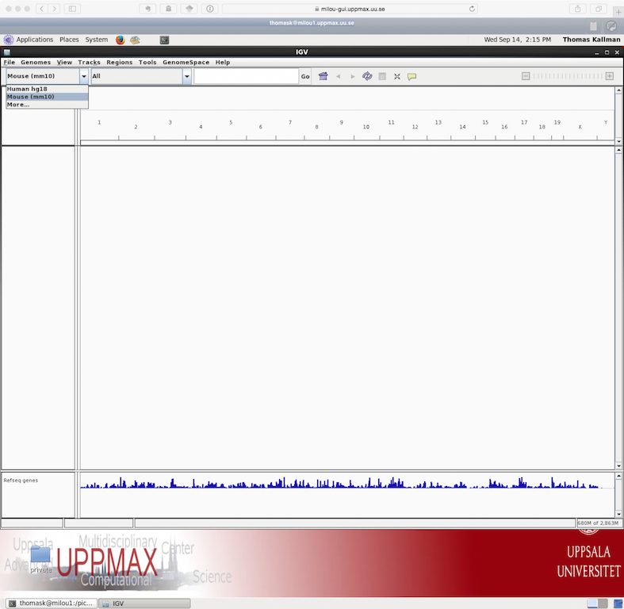

#  RNA-seq data processing and analysis tutorial
RNA-seq has become a powerful approach to study the continually changing cellular transcriptome. Here, one of the most common questions is to identify genes that are differentially expressed between two conditions, e.g. controls and treatment. The **main** exercise in this tutorial will take you through a basic bioinformatic analysis pipeline to answer just that, it will show you how to find differentially expressed (DE) genes. Briefly,

* in the **main exercise**, we will,
  * check the quality of the raw reads with [FastQC](#fastqc)
  * map the reads to the reference genome using [Star](#star)
  * convert between SAM and BAM files format using [Samtools](#samtools)
  * assess the post-alignment reads quality using [QualiMap](#qualimap)
  * count the reads overlapping with genes regions using [featureCounts](#featurecounts)
  * build statistical model to find DE genes using edgeR from a [prepared R script](#descript)

As discussed during the lecture, RNA-seq experiment does not end with a list of DE genes. If you have time after completing the main exercise, try one (or more) of the bonus exercises. The bonus exercises can be run independently of each other, so choose the one that matches your interest.

* In the **bonus section** you can find additional exercises
  * **BEx. 01** [Functional annotation](#functanno) how to put DE genes in the biological context of functional annotations
  * **BEx. 02** [Exon usage](#exon) how to perform analysis of differential exon usage and study alternative splicing
  * **BEx. 03** [Visualisation](#visual) how to view RNA-seq bam files and present DE results with graphics
  * **BEx. 04** [_De novo_ transcriptome assembly](#assembly)  how to assembly transcriptome if no reference is present
  

# Data description

The data you will be using in this exercise is from the recent paper [YAP and TAZ control peripheral myelination and the expression of laminin receptors in Schwann cells. Poitelon et al. Nature Neurosci. 2016](http://www.nature.com/neuro/journal/v19/n7/abs/nn.4316.html). In the experiments performed in this study, YAP and TAZ were knocked-down in Schwann cells to study myelination, using the sciatic nerve in mice as a model.

Myelination is essential for nervous system function. Schwann cells interact with neurons and the basal lamina to myelinate axons using receptors, signals and transcription factors. Hippo pathway is an evolutionary conserved pathway involved in cell contact inhibition, and it acts to promote cell proliferation and inhibits apoptosis. The pathway integrates mechanical signals (cell polarity, mechanotransduction, membrane tension) and gene expression response. In addition to its role in organ size control, the Hippo pathway has been implicated in tumorigenesis, for example its deregulation occurs in a broad range of human carcinomas. Transcription co-activators YAP and TAZ are two major downstream effectors of the Hippo pathway, and have redundant roles in transcriptional activation.

The material for RNA-seq was collected from 2 conditions (wt and YAP(kd)TAZ(kd)), each in 3 biological replicates (see table below).

|  Accession  | Condition | Replicate |
| --- | ----------- | --------- |
| SRR3222409 |  KO | 1 |
| SRR3222410 |  KO | 2 |
| SRR3222411 |  KO | 3 |
| SRR3222412 |  WT  | 1 |
| SRR3222413 |  WT  | 2 |
| SRR3222414 |  WT  | 3 |

For the purpose of this tutorial, that is to shorten the time needed to run various bioinformatics steps, we have down-sampled the original files. We randomly sampled, without replacement, 25% reads from each sample, using fastq-sample from the [fastq-tools](http://homes.cs.washington.edu/~dcjones/fastq-tools/) tools.

# Bioinformatics: processing raw sequencing files
Reading manuals, trying different tools/options, finding solutions to problems are daily routine work for bioinformaticians. By now you should have some experience with using command line and various bioinformatic tools, so in order to feel like a pro we encourage you to try your own solutions to the problems below, before checking the solution key. Click to see the suggested answers to compare them with your own solutions. Discuss with person next to you and ask us when in doubt. Remember that there is more than one way to skin a cat. Have fun!

 
[Jump to the top](#begin)

## Preparing a working directory
To get going, let's book a node, create a working directory named _transcriptome_ in the _/proj/g2017019/nobackup/<username>/_ directory and link the raw sequencing files .fastq.gz. NB! Remember to replace <username> with your uppmax id throughout the exercise.

:computer: **Book a node.** As for other tutorials in this course we have reserved half a node per person. If you have not done it yet today book a node now as otherwise you will take away resources from your fellow course participants.

:key: Click to see how to book a node on Thursday


salloc -A g2017019 -t 08:00:00 -p core -n 8 --no-shell --reservation=g2017019_4 &
 

  

:key: Click to see how to book a node on Friday


salloc -A g2017019 -t 08:00:00 -p core -n 8 --no-shell --reservation=g2017019_5 &
 

  
 

:computer: **Create a folder** named _transcriptome_ for your project in your _/proj/g2017019/nobackup/<username>_ directory. **Create  a sub-folder** called _DATA_.

:key: Click to see suggested commands


cd /proj/g2017019/nobackup/<username>/<username>
mkdir transcriptome
mkdir transcriptome/DATA
 

  
 

:computer: **Sym-link** the .fastq.gz files located in _/sw/courses/ngsintro/rnaseq/DATA/p25_. :bulb: A great chance to practice your bash loop skills.

:key: Click to see suggested commands


cd /proj/g2017019/nobackup/transcriptome/DATA/
for i in /sw/courses/ngsintro/rnaseq/DATA/p25/*
do ln -s $i
done
 

  
 

:white_check_mark: **Check** if you linked the files correctly. You now should be able to see 12 links to the .fastq.gz files.

ll ~/glob/transcriptome/DATA

SRR3222409_1.fastq.gz -> /sw/courses/ngsintro/rnaseq/DATA/p25/SRR3222409_1.fastq.gz
SRR3222409_2.fastq.gz -> /sw/courses/ngsintro/rnaseq/DATA/p25/SRR3222409_2.fastq.gz
...
SRR3222414_2.fastq.gz -> /sw/courses/ngsintro/rnaseq/DATA/p25/SRR3222414_2.fastq.gz

 
 
[Jump to the top](#begin)

##  FastQC: quality check of the raw sequencing reads
After receiving raw reads from a high throughput sequencing centre it is essential to check their quality. Why waste your time on data analyses of the poor quality data? FastQC provide a simple way to do some quality control check on raw sequence data. It provides a modular set of analyses which you can use to get a quick impression of whether your data has any problems of which you should be aware before doing any further analysis.

:mag: **Read** more on [FastQC](http://www.bioinformatics.babraham.ac.uk/projects/fastqc/). Can you figure out how to run it on Uppmax?  
 

:computer: **Create** _fastqc_ folder in your _transcriptome_ directory. **Navigate to _fastqc_ folder**.

:key: Click to see suggested commands


cd /proj/g2017019/nobackup/<username>/transcriptome
mkdir fastqc
cd fastqc
 

  
 

:computer: **Load** _bioinfo-tools_ and _FastQC_ modules

:key: Click to see suggested commands

 
module load bioinfo-tools 
module load FastQC/0.11.5
 

  
 

:computer: **Run** FastQC on all the .fastq.gz files located in the _transcriptome/DATA_. **Direct the output** to the  _fastqc_ folder. :bulb: Check the FastQC option for input and output files. :bulb: The bash loop comes handy again.

:key: Click to see suggested commands


for i in /proj/g2017019/nobackup/<username>/transcriptome/DATA/* 
do 
fastqc $i -o /proj/g2017019/nobackup/<username>/transcriptome/fastqc/ 
done


  
 

:mag: **Download** the FastQC for the proceeded sample from Uppmax to your compute and **have a look** at it. **Go back** to the [FastQC](http://www.bioinformatics.babraham.ac.uk/projects/fastqc/) website and **compare** your report with [Example Report for the Good Illumina Data](http://www.bioinformatics.babraham.ac.uk/projects/fastqc/good_sequence_short_fastqc.html) and [Example Report for the Bad Illumina Data](http://www.bioinformatics.babraham.ac.uk/projects/fastqc/bad_sequence_fastqc.html) data.  
 

:open_mouth: Discuss whether you'd be happy when receiving this very data from the sequencing facility.
 
 
[Jump to the top](#begin)

##  STAR: aligning reads to a reference genome
After verifying that the quality of the raw sequencing reads is acceptable we can map the reads to the reference genome. There are many mappers/aligners available, so it may be good to choose one that is adequate for your type of data. Here, we will use a software called STAR (Spliced Transcripts Alignment to a Reference) as it is good for generic purposes, fast, easy to use and has been shown to outperform many of the other tools when aligning 2x76bp paired-end data (2012). Before we begin mapping, we need to obtain genome reference sequence (.fasta file) and a corresponding annotation file (.gtf) and build a STAR index. Due to time constrains, we will practice on chromosome 11 only. Then we will use the pre-prepared index for the entire genome to do the actual mapping.

### Accessing reference genome and genome annotation file
It is best if the reference genome (.fasta) and annotation (.gtf) files come from the same source to avoid potential naming conventions problems. It is also good to check in the manual of the aligner you use for hints on what type of files are needed to do the mapping.

:mag: **Check** [STAR](https://github.com/alexdobin/STAR) manual what files are needed for the mapping.  
 

:open_mouth: What is the idea behind building STAR index? What files are needed to build one? Where do we take them from? Could one use a STAR index that was generated before?  
 

:computer: **Create** the _reference_ sub-folder in _transcriptome_ directory

:key: Click to see how to create the directory 


mkdir /proj/g2017019/nobackup/<username>/transcriptome/reference


  
 

:computer: **Download** the reference genome .fasta file for chromosome 11, mouse and the corresponding genome annotation .gtf file from Ensmeble webite.

:key: Click for the link to the Ensemble website 

http://www.ensembl.org/info/data/ftp/index.html

:key: Click to see file names to be downloaded 


Mus_musculus.GRCm38.dna.chromosome.11.fa
Mus_musculus.GRCm38.85.gtf


:key: Click to see how to transfer files from Ensembl website to Uppmax 


cd /proj/g2017019/nobackup/<username>/transcriptome/reference
wget ftp://ftp.ensembl.org/pub/release-85/fasta/mus_musculus/dna/Mus_musculus.GRCm38.dna.chromosome.11.fa.gz
wget ftp://ftp.ensembl.org/pub/release-85/gtf/mus_musculus/Mus_musculus.GRCm38.85.gtf.gz


  
 

The files you have just downloaded are compressed using gzip; you need to decompress them before use.

:key: Click to see how 


gzip -d *gz


  
 

:white_check_mark: You should now have *Mus\_musculus.GRCm38.dna.chromosome.11.fa* and *Mus\_musculus.GRCm38.85.gtf* in the sub-folder _reference_  

ll -h /proj/g2017019/nobackup/<username>/transcriptome/reference/
-r--r--r-- 1 olga olga 867699172 Sep 14 15:33 Mus_musculus.GRCm38.81.gtf
-rw-rw-r-- 1 olga olga 124117311 Sep 14 15:42 Mus_musculus.GRCm38.dna.chromosome.11.fa

 
 
[Jump to the top](#begin)

### preparing index

:computer: **Create _indexChr11_ sub-folder** in the _transcriptome_ directory

:key: Click to see how to create directory


mkdir /proj/g2017019/nobackup/<username>/transcriptome/indexChr11
cd /proj/g2017019/nobackup/<username>/transcriptome/indexChr11


  
 

:computer: **Load STAR module** on Uppmax. :bulb: Use _module spider star_ to check which version of STAR are available and load the latest one.

:key: Click to see how to load module


module load star/2.5.1b


  
 

:computer: **Build STAR index** for chromosome 11 using the downloaded reference .fasta and gene annotation .gtf files. :bulb: Check STAR manual for details

:key: Click again to see suggested commands


star --runMode genomeGenerate --runThreadN 8 --genomeDir /proj/g2017019/nobackup/<username>/transcriptome/indexChr11 --genomeFastaFiles /proj/g2017019/nobackup/<username>/transcriptome/reference/Mus_musculus.GRCm38.dna.chromosome.11.fa --sjdbGTFfile /proj/g2017019/nobackup/<username>/transcriptome/reference/Mus_musculus.GRCm38.85.gtf


 

:white_check_mark: Check if building the index worked

ll -h /proj/g2017019/nobackup/<username>/transcriptome/indexChr11
-rw-rw-r-- 1 olga olga   10 Sep 14 15:53 chrLength.txt
-rw-rw-r-- 1 olga olga   13 Sep 14 15:53 chrNameLength.txt
-rw-rw-r-- 1 olga olga    3 Sep 14 15:53 chrName.txt
-rw-rw-r-- 1 olga olga   12 Sep 14 15:53 chrStart.txt
-rw-rw-r-- 1 olga olga  750 Sep 14 15:53 genomeParameters.txt
-rw-rw-r-- 1 olga olga  14K Sep 14 15:54 Log.out
-rw-rw-r-- 1 olga olga  20M Sep 14 15:54 SA_7
drwx------ 2 olga olga 4.0K Sep 14 15:53 _STARtmp

 

:computer: **Sym-link STAR index** to for the entire genome into the _transcriptome_ directory. The index for the whole genome was prepared for us before class in the very same way as for the chromosome 11 in steps above. It just requires more time (ca. 4h) to run. The index can be found here: */sw/courses/ngsintro/rnaseq/index*

:key: Click again to see how to link the index


cd /proj/g2017019/nobackup/<username>/transcriptome/
ln -s /sw/courses/ngsintro/rnaseq/index


 
 
[Jump to the top](#begin)

### mapping
Now we are ready to map our reads to the reference genome, via STAR index.  
 

:computer: **Create _star_ sub-folder** in the _transcriptome_ directory. **Create sub-sub-folder named _SRR3222409_** to save the mapping results for the sample SRR3222409.

:key: Click to see how to create folders 


mkdir /proj/g2017019/nobackup/<username>/transcriptome/star
mkdir /proj/g2017019/nobackup/<username>/transcriptome/star/SRR3222409


 

:computer: **Map reads** to the reference genome for SRR3222409 sample. Do not forget that we are working with paired-end reads so each sample has two matching reads file. **Check** the STAR manual for the parameters to:
 
* use index for the entire genome  
* to read in zipped .fastq.gz files for both forward and reverse reads  
* to run the job on the 8 allocated cores  
* to direct the mapping results to the _SRR3222409_ sub-sub folder  
* to give the results prefix _SRR3222409_   

 
:key: Click to see how to write the mapping command with the above parameters

 
 star --genomeDir /proj/g2017019/nobackup/<username>/transcriptome/index/complete --readFilesIn /proj/g2017019/nobackup/<username>/transcriptome/DATA/SRR3222409_1.fastq.gz /proj/g2017019/nobackup/<username>/transcriptome/DATA/SRR3222409_2.fastq.gz --runThreadN 8 --readFilesCommand zcat --outFileNamePrefix /proj/g2017019/nobackup/<username>/transcriptome/star/SRR3222409/SRR3222409_
 
 

 

:white_check_mark: You should now have .sam file in the _SRR3222409_ as well as a series of log files. Have a look how the mapping went.

ll -h ~/transcriptome/star/SRR3222409

total 3.0G
-rw-rw-r-- 1 olga olga 3.0G Sep 14 16:05 SRR3222409_Aligned.out.sam
-rw-rw-r-- 1 olga olga 1.9K Sep 14 16:05 SRR3222409_Log.final.out
-rw-rw-r-- 1 olga olga  18K Sep 14 16:04 SRR3222409_Log.out
-rw-rw-r-- 1 olga olga  364 Sep 14 16:04 SRR3222409_Log.progress.out
-rw-rw-r-- 1 olga olga 3.6M Sep 14 16:05 SRR3222409_SJ.out.tab
drwx------ 2 olga olga 4.0K Sep 14 16:04 SRR3222409__STARtmp

 
 

:computer: **Map or copy over**. Map the remaining samples in the analogous way. Running short of time? Copy over the results that we have prepared for you before the class. They are here: */sw/courses/ngsintro/rnaseq\_2016/main/Star*

:key: Click to see how to copy results, sample by sample


cp -r /sw/courses/ngsintro/rnaseq/main/star/SRR3222410/ /proj/g2017019/nobackup/<username>/transcriptome/star/


:key: Click to see how to copy results using bash loop


for i in SRR3222411 SRR3222412 SRR3222413 SRR3222414
do
cp -r /sw/courses/ngsintro/rnaseq/main/star/$i /proj/g2017019/nobackup/<username>/transcriptome/star/
done


 
 
[Jump to the top](#begin)

###  Samtools: converting between SAM and BAM
Before we proceed further with our data processing, let's convert our mapped reads from STAR, saved in the default .SAM text format, into the binary .BAM format. Why? BAM files take less space so it is easier to store them and they are the most commonly required file format for many of the down-stream bioinformatics tools. In addition, they can be sorted and indexed shortening the time needed to proceed them in comparison with .SAM format. Also, then they will be ready for exploration in IGV, the Integrative Genomic Viewer.

:mag: **Read** through [Samtools](http://www.htslib.org/doc/samtools.html) documentation and see if you can figure it out how to:
* convert SAM into BAM
* sort BAM files
* index BAM files
 

:computer: **Create _bams_ sub-folder** in _transcriptome_, **navigate to _bams_ sub-folder** and **load samtools module**

:key: Click to see the suggested commands, file by file


mkdir /proj/g2017019/nobackup/<username>/transcriptome/bams
cd /proj/g2017019/nobackup/<username>/transcriptome/bams 
module load samtools/1.3


 

:computer: **Sym-link** in _bams_ sub-folder all the SAM files containing the mapped reads, as created during the Star mapping step. :bulb: You can use the bash loop if you apply wild cards (slightly more advanced but try first before looking at the answer key)

:key: Click to see the suggested commands, sample by sample


ln -s /proj/g2017019/nobackup/<username>/transcriptome/star/SRR3222409/SRR3222409_Aligned.out.sam


:key: Click to see the suggested commands, using bash loop


for i in /proj/g2017019/nobackup/<username>/transcriptome/star/**/*.sam 
do ln -s $i
done


 

:white_check_mark: Check to see the linked files

ll -h  /proj/g2017019/nobackup/<username>/transcriptome/bams/*.sam

lrwxrwxrwx 1 olga olga 72 Sep 14 16:39 SRR3222409_Aligned.out.sam -> /home/olga/glob/transcriptome/star/SRR3222409/SRR3222409_Aligned.out.sam
lrwxrwxrwx 1 olga olga 72 Sep 14 16:39 SRR3222410_Aligned.out.sam -> /home/olga/glob/transcriptome/star/SRR3222410/SRR3222410_Aligned.out.sam
...
lrwxrwxrwx 1 olga olga 72 Sep 14 16:39 SRR3222414_Aligned.out.sam -> /home/olga/glob/transcriptome/star/SRR3222414/SRR3222414_Aligned.out.sam

 

:computer: **Convert SAM to BAM**: for the first sample *SRR3222409\_Aligned.out.sam* into *SRR3222409\_Aligned.out.bam*

:key: Click to see the suggested commands


samtools view -bS -o SRR3222409_Aligned.out.bam SRR3222409_Aligned.out.sam


 

:computer: **Convert SAM to BAM** for the remaining samples or **copy them over**. You can find the BAMs prepared for your in */sw/courses/ngsintro/rnaseq/main/bams/out*

:key: Click to see how to copy over sample by sample


cp /sw/courses/ngsintro/rnaseq/main/bams/out/SRR3222410_Aligned.out.bam /proj/g2017019/nobackup/<username>/transcriptome/bams/


:key: Click to see how to copy over using a bit more advanced bash loop


for i in SRR3222411 SRR3222412 SRR3222413 SRR3222414
do cp "/sw/courses/ngsintro/rnaseq/main/bams/out/"$i"_Aligned.out.bam" /proj/g2017019/nobackup/<username>/transcriptome/bams/ 
done


 

:white_check_mark: Check to see the converted BAM files

ll -h  /proj/g2017019/nobackup/<username>/transcriptome/bams/*.bam

-rw-rw-r-- 1 olga olga 792M Sep 14 16:46 SRR3222409_Aligned.out.bam
-rw-rw-r-- 1 olga olga 596M Sep 14 16:51 SRR3222410_Aligned.out.bam
...
-rw-rw-r-- 1 olga olga 1.1G Sep 14 16:54 SRR3222414_Aligned.out.bam

 

:computer: **Sort BAM file** sort *SRR3222409\_Aligned.out.bam* file and save it as *SRR3222409\_Aligned.out.sorted.bam* in the *bams* sub-folder

:key: Click to see how to sort BAM file


samtools sort -o /proj/g2017019/nobackup/<username>/transcriptome/bams/SRR3222409_Aligned.out.sorted.bam -T sort_temp /proj/g2017019/nobackup/<username>/transcriptome/bams/SRR3222409_Aligned.out.bam


 

:computer: **Sort BAM files** for the remaining samples or **copy them over**. You can find the BAMs prepared for your in */sw/courses/ngsintro/rnaseq/main/bams/out*, ending with *sorted.bam*

:key: Click to see how to copy over sample by sample


cp /sw/courses/ngsintro/rnaseq/main/bams/out/SRR3222410_Aligned.out.sorted.bam /proj/g2017019/nobackup/<username>/transcriptome/bams/


:key: Click to see how to copy over using a bit more advanced bash loop. It is the same as above, just the file extension is different. 


for i in SRR3222411 SRR3222412 SRR3222413 SRR3222414 
do cp "/sw/courses/ngsintro/rnaseq/main/bams/out/"$i"_Aligned.out.sorted.bam" /proj/g2017019/nobackup/<username>/transcriptome/bams/
done


 

:white_check_mark: Check to see the sorted BAM files

ll -h  /proj/g2017019/nobackup/<username>/transcriptome/bams/*.sorted.bam

-rw-rw-r-- 1 olga olga 492M Sep 14 16:59 SRR3222409_Aligned.out.sorted.bam
-rw-rw-r-- 1 olga olga 375M Sep 14 17:01 SRR3222410_Aligned.out.sorted.bam
...
-rw-rw-r-- 1 olga olga 631M Sep 14 17:02 SRR3222414_Aligned.out.sorted.bam

 

:computer: **Index the sorted BAM files**

:key: Click to see how to index BAM file, sample by sample


samtools index /proj/g2017019/nobackup/<username>/transcriptome/bams/SRR3222410_Aligned.out.sorted.bam


:key: Click to see how to index BAM file, using bash loop


for i in  /proj/g2017019/nobackup/<username>/transcriptome/bams/*.sorted.bam
do samtools index $i
done


 

:white_check_mark: Check to see the BAM indexes

ll -h  /proj/g2017019/nobackup/<username>/transcriptome/bams/*.bai

-rw-rw-r-- 1 olga olga 2.7M Sep 14 17:06 SRR3222409_Aligned.out.sorted.bam.bai
-rw-rw-r-- 1 olga olga 2.7M Sep 14 17:06 SRR3222410_Aligned.out.sorted.bam.bai
...
-rw-rw-r-- 1 olga olga 2.8M Sep 14 17:07 SRR3222414_Aligned.out.sorted.bam.bai

 
 
[Jump to the top](#begin)

###  QualiMap: post-alignment quality control
Some important quality aspects, such as saturation of sequencing depth, read distribution between different genomic features or coverage uniformity along transcripts, can be measured only after mapping reads to the reference genome. One of the tools to perform this post-alignment quality control is QualiMap. QualiMap examines sequencing alignment data in SAM/BAM files according to the features of the mapped reads and provides an overall view of the data that helps to the detect biases in the sequencing and/or mapping of the data and eases decision-making for further analysis.

:mag: **Read** through [QuliMap](http://qualimap.bioinfo.cipf.es/doc_html/intro.html) documentation and see if you can figure it out how to run it to assess post-alignment quality on the RNA-seq mapped samples. The tool is already installed on Uppmax and available as QuliMap module  
 

:computer: **Create QualiMap** sub-folder in _transcriptome_ directory, **navigate to _qualimap_ sub-folder** and **load QualiMap/2.2 module**

:key: Click to see the suggested commands


mkdir /proj/g2017019/nobackup/<username>/transcriptome/qualimap 
cd /proj/g2017019/nobackup/<username>/transcriptome/qualimap/
module load QualiMap/2.2


 

:computer: **Run QualiMap** for the fist sample on sorted BAM file *SRR3222409\_Aligned.out.sorted.bam* **directing** the results to */proj/g2017019/nobackup/<username>/transcriptome/qualimap/SRR3222409* folder. :bulb: QualiMap creates the folder if you specify the right parameter

:key: Click to see the suggested commands


qualimap rnaseq -pe -bam /proj/g2017019/nobackup/<username>/transcriptome/bams/SRR3222409_Aligned.out.sorted.bam -gtf /proj/g2017019/nobackup/<username>/transcriptome/reference/Mus_musculus.GRCm38.85.gtf --outdir /proj/g2017019/nobackup/<username>/transcriptome/qualimap/SRR3222409 --java-mem-size=63G > /dev/null 2>&1


 

:white_check_mark: Check if the QualiMap run correctly

ll -h /proj/g2017019/nobackup/<username>/transcriptome/qualimap/SRR3222409/

total 28K
drwxrwxr-x 2 olga olga 4.0K Sep 14 17:24 css
drwxrwxr-x 2 olga olga 4.0K Sep 14 17:24 images_qualimapReport
-rw-rw-r-- 1 olga olga  11K Sep 14 17:24 qualimapReport.html
drwxrwxr-x 2 olga olga 4.0K Sep 14 17:24 raw_data_qualimapReport
-rw-rw-r-- 1 olga olga 1.2K Sep 14 17:24 rnaseq_qc_results.txt

 

:computer: **Run QualiMap** for the remaining sorted BAM files or **copy the results over**. These can be found */sw/courses/ngsintro/rnaseq\_2016/main/qualimap*

:key: Click to see how to copy over the results, sample by sample


cp -r /sw/courses/ngsintro/rnaseq/main/qualimap/SRR3222410 /proj/g2017019/nobackup/<username>/transcriptome/qualimap/


:key: Click to see how to copy over the results, using bash loop


for i in SRR3222409 SRR3222410 SRR3222411 SRR3222412 SRR3222413 SRR3222414
do cp -r "/sw/courses/ngsintro/rnaseq/main/qualimap"/$i /proj/g2017019/nobackup/<username>/transcriptome/qualimap/
done


 

:open_mouth: **Check the QualiMap results**. What do you think? Are the samples of good quality? How can you tell?  
 
 
[Jump to the top](#begin)

###  featureCounts: counting reads
After ensuring mapping quality we can count the reads to obtain a raw count table. We could count the reads by hand, opening the BAM in the IGV along the genome annotation file, and counting the reads overlapping with the regions of interest. This of course would take forever for the entire genome but it is never a bad idea to see how the data look like for the selected few genes of interest. For get the counts for the entire genome one can use many of the already available tools doing just that. Here we will use featureCounts, an ultrafast and accurate read summarization program, that can count mapped reads for genomic features such as genes, exons, promoter, gene bodies, genomic bins and chromosomal locations.

:mag: **Read** [featureCounts](http://bioinf.wehi.edu.au/featureCounts/) documentation and see if you can figure it out how to run summarize paired-end reads and count fragments overlapping with exonic regions.  
 

:computer: **Create featurecounts** sub-folder in the _transcriptome_ directory and **navigate** there.

:key: Click to see how...


mkdir /proj/g2017019/nobackup/<username>/transcriptome/featurecounts
cd /proj/g2017019/nobackup/<username>/transcriptome/featurecounts


 

:computer: **Load featureCounts** module. :bulb: featureCounts is available on Uppmax as part of the _subread_ package

:key: Click to see how to load featureCounts


module load subread


 

:computer: **Sym-link** SAM files generated by Star and located in */proj/g2017019/nobackup/<username>/transcriptome/star*

:key: Click to see sym-link files, sample by sample


ln -s /proj/g2017019/nobackup/<username>/transcriptome/star/SRR3222409/SRR3222409_Aligned.out.sam


:key: Click to see sym-link files, using bash loop


for i in /proj/g2017019/nobackup/<username>/transcriptome/star/**/*.sam
do 
ln -s $i
done


 

:computer: **Run featureCounts** on the SAM files, **counting** fragments overlapping exon regions and **saving** the count tables as _tableCounts_. :bulb: The libraries are un-stranded and you can proceed all the samples in one go.

:key: Click to see how to run featureCounts on all samples


featureCounts -p -a /proj/g2017019/nobackup/<username>/transcriptome/reference/Mus_musculus.GRCm38.85.gtf -t gene -g gene_id -s 0 -o tableCounts *.sam


 

:white_check_mark: Check if featureCounts run. You should have two files now:

ll -h /proj/g2017019/nobackup/<username>/transcriptome/DE/table*

-rw-rw-r-- 1 olga olga 2.8M Sep 15 11:05 tableCounts
-rw-rw-r-- 1 olga olga  658 Sep 15 11:05 tableCounts.summary

 

:open_mouth: **Have a look** at the _tableCounts_ and _tableCounts.summary_. Can you figure out what these files contain? Do you think that counting work? How can you tell?
 
 
[Jump to the top](#begin)

### MultiQC: combining QC measures across all the samples
:mag: **Read** more on [MultiQC](http://multiqc.info). Can you figure out why this tool has become very popular? Can you figure out how to combine FastQC, Star, QualiMap and featureCounts results for all the samples into interactive report?
 

:computer: **Navigate** to _transcriptome_ directory and *load module MultiQC/0.6*

:key: Click to see how 


cd /proj/g2017019/nobackup/<username>/transcriptome
module load MultiQC/0.6


 

:computer: **Run** MultiQC

:key: Click to see how to run MultiQC


multiqc .


 

:open_mouth: **Transfer** the MultiQC report to your computer and have a look at it.  What can you notice?
 
 
[Jump to the top](#begin)

###  Differential expression
As mentioned during the lecture, the best way to perform differential expression is to use one of the statistical packages, within **R environment**, that were specifically designed for analyses of read counts arising from RNA-seq, SAGE and similar technologies. Here, we will one of such packages called [edgeR](https://bioconductor.org/packages/release/bioc/html/edgeR.html). Learning R is beyond the scope of this course so we prepared basic ready to run scripts from a command line scripts to find DE genes between Ko and Wt.

:computer: **Create** _DE_ sub-folder in the _transcriptome_ directory and **navigate** there

:key: Click to see how 


mkdir /proj/g2017019/nobackup/<username>/transcriptome/DE 
cd /proj/g2017019/nobackup/<username>/transcriptome/DE


 

:computer: **Load R module and R packages**

:key: Click to see how 


module load R/3.3.0
module load R_packages/3.3.0


 

:computer: **Sym-link** _tableCounts_ as created by featureCounts and **sym-link** the prepared gene annotation file *tableCounts_annotation.txt* prepared by us before the class and located: */sw/courses/ngsintro/rnaseq/main/DE* as well as **sym-link** R script located in the same directory

:key: Click to see how 


ln -s /proj/g2017019/nobackup/<username>/transcriptome/featurecounts/tableCounts
ln -s /sw/courses/ngsintro/rnaseq/main/DE/tableCounts_annotations.txt
ln -s /sw/courses/ngsintro/rnaseq/main/DE/diffExp.R


 

:computer: **Run diffExp.R script**

:key: Click to see how 


R CMD BATCH diffExp.R


 

:white_check_mark: A file *results\_DE.txt* should be created in the _DE_ sub-folder  

ll -h /proj/g2017019/nobackup/<username>/transcriptome/DE

-rw-rw-r-- 1 olga olga 8.9M Nov 29 16:31 DEdata.RData
lrwxrwxrwx 1 olga olga   50 Nov 29 16:30 diffExp.R -> /sw/courses/ngsintro/rnaseq/main/DE/diffExp.R
-rw-rw-r-- 1 olga olga 3.4K Nov 29 16:31 diffExp.Rout
-rw-rw-r-- 1 olga olga 2.6M Nov 29 16:31 results_DE.txt
lrwxrwxrwx 1 olga olga   55 Nov 29 16:30 tableCounts -> /proj/g2017019/nobackup/<username>/transcriptome/featurecounts/tableCounts
lrwxrwxrwx 1 olga olga   68 Nov 29 16:30 tableCounts_annotations.txt -> /sw/courses/ngsintro/rnaseq/main/DE/tableCounts_annotations.txt

 

:open_mouth: **Copy over** to your computer **open** the *results\_DE.txt*
 file in Excel or alike. Given FDR value of 0.05, how many DE genes are there? How many up and down-regulated? What are the top changes? How does it change when we only look at the DE that have minimum log-fold-change 1?
 
 
[Jump to the top](#begin)

#  Bonus exercise: from differential expression to biological knowledge

## Introduction to functional annotation
In this part of the exercise we will address the question which biological processes are affected in the experiment; in other words we will functionally annotate the results of the analysis of differential gene expression (performed in the main part of the exercise). We will use [Gene Ontology (GO) term](http://geneontology.org/) and [reactome pathway](http://reactome.org/) annotations.

When performing this type of analysis one has to keep in mind that the analysis is only as accurate as the annotation available for your organism, so if working with non-mainstream model organisms which do have most of the annotations only electronically inferred (as opposed to direct evidence), the results may not be fully reflecting the actual situation.

There are many methods to approach the question which biological processes and pathways are overrepresented amongst the differentially expressed genes, compared to all genes included in the analysis. They use several types of statistical tests (e.g. hypergeometric test, Fisher's exact test), and many have been developed with microarray data in mind. Not all of these methods are appropriate for RNA-seq data, which as you remember from the lecture, exhibit length bias in power of detection of differentially expressed genes (i.e. longer genes, which tend to gather more reads, are more likely to be detected as "differentially expressed" than shorter genes, solely because of the length).

We will use the R / Bioconductor package [goseq](http://bioconductor.org/packages/release/bioc/html/goseq.html), specifically designed to work with RNA-seq data. This package provides methods for performing Gene Ontology  and pathway analysis of RNA-seq data, taking length bias into account.

In this part, we will use the same data as in the main workflow. The starting point of the exercise is the file with results of the differential expression produced in the main part of the exercise.

Running functional annotation is typically not computationaly-heavy and it may be easier to run it on your local computer. Therefore this module can be performed on Uppmax or on your local computer. For the latter you need have [R statistical programming language](https://cran.r-project.org/) installed. An optional graphical interface to R such as [RStudio](https://www.rstudio.com/) is also recommended.

Follow :computer: icon for running the module on Uppmax. Follow :floppy_disk: to run things on your own computer. 

## Setting-up workspace 

:floppy_disk: **Install packages** used in the exercise. You can do it by pasting the following two commands in R session:
 
 `source("http://bioconductor.org/biocLite.R")`
  
 `biocLite(c("goseq","GO.db","reactome.db","org.Mm.eg.db"))`
 

 
:computer: :floppy_disk: To perform the exercise you will need data included in the following location at Uppmax:
 
 `/sw/courses/ngsintro/rnaseq/bonus/funannot`
 
 

:floppy_disk: **Copy over** the directory to your working directory on your local computer

 
:key: Click to see an example of a command

 
 scp -r YOUR_LOGIN@milou.uppmax.uu.se:/sw/courses/ngsintro/rnaseq/bonus/funannot ./
 

 

:computer: **Copy over** the directory to your working space _transcriptome_

:key: Click to see an example of a command


cp -r /sw/courses/ngsintro/rnaseq/bonus/funannot/ /proj/g2017019/nobackup/<username>/transcriptome/


 

## Workflow

:computer: **Load R and R modules** required in the exercise:
 

 
:key: Click to see an example of a command

 
 module purge
 module load R/3.3.0
 module load R_packages/3.3.0
 
 

 

:computer: **Enter** the exercise working directory:

:key: Click to see how


cd /proj/g2017019/nobackup/<username>/transcriptome/funannot


 

:computer: **To perform the functional annotation** you can use a wrapper script *annotate\_de\_results.R*, which is executed as in the main exercise:

:key: Click to see how


Rscript annotate_de_results.R


 
The results will be saved in the directory *GO\_react\_results*.
 
 
 
:floppy_disk: **Enter** the exercise working directory:

:key: Click to see how


cd /funannot


 

:floppy_disk: **To perform the functional annotation** you can use a wrapper script *annotate\_de\_results.R*, which is executed as in the main exercise:

:key: Click to see how


Rscript annotate_de_results.R


 
The results will be saved in the directory *GO\_react\_results*.
 

:floppy_disk: Alternatively, you can open the script in RStudio (or a text editor such as Atom or Sublime) and execute each step of the script in a live R session. This way you will be able to "see inside" the script and you can try to follow the individual steps.  

## Interpretation
:computer: :floppy_disk: The results are saved as tables in the directory *GO\_react\_results*.
 

The columns of the results tables are:  
|  category  | over_represented_pvalue | under_represented_pvalue | numDEInCat | numInCat  | term | ontology |
 

You can view the tables in a text editor, and try to find GO terms and pathways relevant to the experiment using a word search functionality.  
 

:floppy_disk: The results are also collected in the following objects:  

go.dn.adj
go.up.adj
react.dn.adj.annot
react.up.adj.annot


 
You can explore the results either by printing them all on the screen  

:key: Click to see example 


go.dn.adj


 
or by performing a string search using grep

:key: Click to see example 


grep("myelin", go.dn.adj$term,  value=T)


:key: Click to see example 


grep("neuro", go.dn.adj$term,  value=T)


 

:open_mouth: Do you think the functional annotation reflects the biology of the experiments we have just analysed?  
 
 
[Jump to the top](#begin)

#  Bonus exercise: exon usage

## Introduction to differential exon usage

Multi-exon genes are affected by alternative
splicing and thus can express a variety of different
transcripts from the same genomic sequence. Differences in the relative expression of these isoforms between tissues and species occur naturally between cell types and allow cells to adapt to the environment.

It is important to distinguish differential transcript usage (DTU) from gene-level differential expression (which was covered in the main part of the exercise) and from transcript-level differential expression. DTU considers changes in the **proportions** of the isoforms of a gene that are expressed as opposed to changes of the individual transcript levels.

Although the main units of interest are the transcripts, it has been difficult to obtain accurate and precise transcript-level expression estimates due to the extensive overlap between different transcripts. To circumvent that number of methods have been developed that, instead of estimating expression levels of transcripts, analyse levels of transcript building blocks (exons).  Hence, differential exon usage (DEU) can be viewed as a proxy to the differential transcript usage.

Note that DEU is a more general concept than alternative splicing since it also includes changes in the usage of alternative transcript start sites and polyadenylation sites, which can cause differential usage of exons at the 5' and 3' boundary of transcripts.

The Bioconductor package **DEXSeq** implements a method to test for differential exon usage in comparative
RNA-Seq experiments. By differential exon usage we mean changes in the **relative** usage
of exons caused by the experimental condition. The relative usage of an exon is defined as number of transcripts from the gene that contain this exon vs. number of all transcripts from the gene.

In this exercise we will use reads mapped to chromosome 11 only as performing this analysis on entire data set is quite time consuming and requires considerable computing power. The starting point are files with reads summarised per each annotated exon, prepared beforehand by us.

This module can be performed on Uppmax, or on your local computer if you have installed [R statistical programming language](https://cran.r-project.org/) and (optionally) a graphical interface to R such as [RStudio](https://www.rstudio.com/).

Follow :computer: icon for running the module on Uppmax. Follow :floppy_disk: to run things on your own computer. 

## Setting-up workspace 

Libraries to install and load if exercise is performed locally

:floppy_disk: **Install packages** used in the exercise. You can do it by pasting the following two commands in R session:

 `source("http://bioconductor.org/biocLite.R")`
 
 `biocLite("DEXSeq")`

 
:floppy_disk: In addition you may need to install X11 app ([XQuartz](https://www.xquartz.org/) on MacOS) to produce the html report.

 
:computer: :floppy_disk: To perform the exercise you will need data included in the following location at Uppmax:

  `/sw/courses/ngsintro/rnaseq/bonus/exon`

 
:computer: **Copy over** the directory _transcriptome_ folder

:key: Click to see an example of a command


cp -r /sw/courses/ngsintro/rnaseq/bonus/exon /proj/g2017019/nobackup/<username>/transcriptome


 

:floppy_disk: **Copy over** the directory to your workspace on your local computer

:key: Click to see an example of a command


scp -r YOUR_LOGIN@milou.uppmax.uu.se:/sw/courses/ngsintro/rnaseq/bonus/exon ./


 

## Workflow

:computer: **Load R and R modules** required in the exercise:

:key: Click to see how

 
 module purge
 module load R/3.3.0
 module load R_packages/3.3.0
 

 

**Enter** the exercise working directory:

:key: Click to see how


cd /proj/g2017019/nobackup/<username>/transcriptome/exon


 

:computer: **Perform the functional annotation** using a wrapper script *deu.R*

:key: Click to see how


Rscript deu.R


 

:floppy_disk: **Enter** the exercise working directory:

:key: Click to see how


cd /exon


 

:floppy_disk: **Perform the functional annotation** using a wrapper script *deu.R*

:key: Click to see how


Rscript deu.R


 

:floppy_disk: Alternatively, you can open the script in RStudio (or a text editor such as Atom or Sublime) and execute each step of the script in a live R session. This way you will be able to "see inside" the script and try to follow the individual steps.
 

 
:computer: :floppy_disk: The results in html format are saved in the directory ***DEXSeqReport***. For detailed description of the individual report sections please consult [DEXSeq user manual](http://bioconductor.org/packages/release/bioc/vignettes/DEXSeq/inst/doc/DEXSeq.pdf). Additionally, a table with significant exons and statistics relevant to their differential usage ***deu\_signif\_exons.txt*** is saved in the working directory.
 

:open_mouth: How many differentially used exons were identified in the data? Do you think this result makes sense?
 
 
[Jump to the top](#begin)

#   Bonus exercise: RNA-seq visualisation

## Introduction

Data visualisation is important to be able to clearly convey results,
but can also be very helpful as tool for identifying issues and
noteworthy patterns in the data. In this part you will use the bam
files you created earlier in the RNA-seq lab and use IGV (Integrated
Genomic Viewer) to visualize the mapped reads and genome
annotations. In addition we will produce high quality plots of both
the mapped read data and the results from differential gene
expression.

## IGV

If you are already familiar with IGV you can load the mouse genome and
at least one bam file from each of the treatments that you created
earlier. The functionality of IGV is the same as if you look at
genomic data, but there are a few of the features that are more
interesting to use for RNA-seq data.

[Integrated genomics viewer](http://software.broadinstitute.org/software/igv/) from Broad Institute is a nice graphical
interface to view bam files and genome annotations. It also has tools
to export data and some functionality to look at splicing patterns in
RNA-seq data sets. Even though it allows for some basic types of
analysis it should be used more as a nice way to look at your mapped
data. Looking at data in this way might seem like a daunting approach
as you can not check more than a few regions, but in in many cases it
can reveal mapping patterns that are hard to catch with just summary
statistics.

For this tutorial you can chose to run IGV directly on your own computer (follow :floppy_disk:)
or on Uppmax (follow :computer:). If you chose to run it on your own computer you will
have to download some of the bam files (and the corresponding index
files) from Upppmax. If you have not yet installed IGV you also
have to get a copy of the program. 

:floppy_disk: **Copy bam files** to your local computer and **run IGV**

:key: Click to see how to transfer files from Uppmax


scp username@milou.uppmax.uu.se:/proj/g2017019/nobackup/<username>/transcriptome/bamfile.bam .

NB! Use the sorted bam files and also copy over the .bai files

 

:computer:  **Log in to Uppmax** in a way so that the generated graphics are exported via the network to your screen
 
:computer:  Method 1. Login in to Uppmax with X-forwarding enabled

:key: Click to see how


ssh -Y username@milou.uppmax.uu.se
ssh -Y computenode


This will allow any graphical interface that you start
on your compute node to be exported to your computer. However, as
the graphics is exported over the network it can be fairly slow in
redrawing windows and the experience can be fairly poor.

:computer: Method 2. Go to [Milou-gui](https://milou-gui.uppmax.uu.se/main/)

Once you log into this interface you will have a linux desktop
interface in a browser window. This interface is running on the login
node so if you want to do any heavy lifting you need to login to your
reserved compute node also here. This is done by opening a terminal in
the running linux environment and log on to your compute node as before
NB! If you have no active reservation you have to do that first.

 
:computer: **Load necessary modules** and start IGV

module load bioinfo-tools
module load IGV/2.3.40
igv-core


This should start the IGV so that it is visible on your screen. If not please try to
reconnect to Uppmax or consider running IGV locally as that is often
the fastest and most convinient solution. 

 
:computer: :floppy_disk: Once we have the program running you select the genome that you would
like to load. As seen in the image below. 

Note that if you are working with a genome that are not part of the
available genomes in IGV, one can create genome files from within
IGV. Please check the manual of IGV for more information on that.

To open your bam files click on File and chose the option "Load from
file" select your bam file and make sure that you have a .bai index
for that bam file in the same folder. You can repeat this and open
multiple bam files in the same window, which makes it easy to compare
samples. For every file you open a number of panels are opened that
visualize the data in different ways. The first panel named "Coverage"
summarize the coverage of basepairs in the window you have zoomed
to. The second that ends with the name "Junctions" show how reads were
spliced to map, eg. reads that stretch over multiple exons are split
and mapped one part in one exon and the next in another exon. The
third panel shows the reads as they are mapped to the genome. If one
right click with the mouse on the read panel there many options to
group and color reads. 

To see actual reads you have to zoom in until the reads are
drawn on screen. If you have a gene of interest you can also use
the search box to directly go to that gene. 

If you for example search for the gene "Mocs2" you should see a decent
amount of reads mapping to this region. For more detailed information
on the splice reads you can instead of just looking at the splice
panel right click on the read panel and select "Sashimi plots" This
will open a new window showing in an easy readable fashion how reads
are spliced in mapping and you will also be able to see that there are
differences in between what locations reads are spliced. This hence
gives some indication on the isoform usage of the gene.

To try some of the features available in IGV you can try to address the following
questions. 

:open_mouth: Are the reads you mapped from a stranded or unstranded library?

:open_mouth: Pick a gene from the toplist of most significant genes from the DE
analysis and search for it using the search box in IGV. Would you say that
the pattern you see here confirms the gene as differentially expressed
between treatments?

:open_mouth: One can visualize all genes in a given pathway using the gene list
option under "Regions" in the menu. Would you agree with what they
state in the paper about certain pathways being down-regulated. If you need
hints for how to proceed see [Gene List tutorial at Broad](http://software.broadinstitute.org/software/igv/gene_list_view).

# Create publication ready plots from RNA-seq data

Creating high quality plots of RNA-seq analysis are most easily done
using [R](https://www.r-project.org). Depending on your profiency in
reading r-code and using R you can in this section either just call
scripts from the command lines with a set of arguments or you can open
the r-script in a text editor and run the code step by step from an
interactive r-session. Irrespective of the method you choose make sure
you load the same R modules as before and do all steps on a compute
node.

:computer: **Load R module and R packages**

:key: Click to see how 


module load R/3.3.0
module load R_packages/3.3.0


 

Some of the example plots we generate here are based on the results from the DE analysis so
perform all of these steps from within the DE folder that you created earlier. 

Start by copying the scripts from the course folder to your DE directory.

:computer: **Move** to DE and **copy** R-scripts

:key: Click to see how to copy the files to your DE folder


cd /proj/g2017019/nobackup/<username>/transcriptome/DE
cp /sw/courses/ngsintro/rnaseq/bonus/visual/*.R .


You should now have four files in your DE folder.      We
start off by creating similar plots to how data is visualised in IGV,
but using R means that we could add other types of information that
are not implemented in IGV.

:mag: To look at read coverage in our bam files for a gene of interest
(pick one that was reported to be differentially expressed) and go to
the Ensembl to identify genomic coordinates and chromosome location
for this gene.

:computer: Run the script named genePlot.R

Rscript genePlot.R chromosome start stop


:key: Click to see a an real example


Rscript genePlot.R 14 31217860 31230350 


 
This will generate a plot named coverage.pdf that show annotations and
read coverage for the 6 bam files we use in the analysis for
chromosome 14 from postion 31217860 to 31230350. 
 
:floppy_disk: To view the file copy it from Uppmax to your own computer and open it in a
pdf reader.

:key: Click to see command to copy files


scp username@milou.uppmax.uu.se:/proj/g2017019/nobackup/<username>/transcriptome/DE/coverage.pdf .

Make sure you run this command from your own computer

 

Besides this type of plot that sort of mimics what can be done in IGV, R
makes it possible to visualise patterns of gene expression in many
different ways. Here we will create a few different plots that is
often seen and used in RNA-seq expression analysis.

## MDS plot 

A popular way to visualise general patterns of gene expression in your
data is to produce either PCA (Principal Component Analysis) or MDS
(MultiDimensional Scaling) plots. These methods aim at summarizing the
main patterns of expression in the data and display them on a
two-dimensional space and still retain as much ingformation as
possible. To properly evaluate these kind of results is non-trivial,
but in the case of RNA-seq data we often use them to get an idea of
the difference in expression between treatments and also to get an idea
of the similarity among replicates. If the plots shows clear clusters
of samples that corresponds to treatment it is an indication of
treatment actually having an effect on gene expression. If the
distance between replicates from a single treatment is very large it
suggests large variance within the treatment, something that will
influence the detection of differentially expressed genes
between treatments.

To generate a MDS plot showing that show the the two leading fold
changes in gene expression between samples run the MAplot.R script as
this.

:computer: Run the script named MDSplot.R

:key: Click to see how to do this


Rscript MDSplot.R 


 
This generates another pdf file named MAplot.pdf in the DE folder. To
view it copy it to your local disk as before.
 

:open_mouth: Based on these results are you surprised that your DE analysis
detected a fairly large number of significant genes?

## MA-plot and Volcanoplot

One can also visualize the actual results of a differential gene
expresssion analysis in many different ways. One way is by generating
a MA-plot that plots the mean expression and estimated log ratios for
all genes in an analysis.

To create an MA plot for your analysis you can run the script called
MAplot.R from your DE folder. It will read in the results from the DE
analysis that you did earlier and produce the plot saved as MA-plot.pdf.

:computer: Run the script MAplot.R

:key: Click to see how to do this


Rscript MAplot.R


 

:open_mouth: What do you think the red dots represent?
 

A related type of figure will instead plot fold change (on log2 scale) on the x-axis
and -log10 p-value on the y-axis. Scaling like this means that genes
with lowest p-value will be found at the top of the plot. In this example
we will highligt (in red) the genes that are significant at the 0.05
level after correction for multiple testing and that have an estimated fold
change larger than 4 (log2 (4) = 2).

:computer: Run the script named Volcano.R

:key: Click to see how to do this


Rscript Volcano.R


 

:open_mouth: Anything noteworthy about the patterns in the plot?
 

Other type of popular plots for genome-wide expression patterns is to
create heatmaps for sets of genes. If you run the script called
heatmap.R from the folder where your DE is saved it will extract the
50 genes that have the lowest p-value in the experiment and create a
heatmap from these. In addition to colorcoding the expression levels
over samples for the genes it also clusters the samples and genes
based on inferred distance between them.

:computer: Run the script named heatmap.R

:key: Click to see how to do this


Rscript heatmap.R


 
:open_mouth: Compare this plot to a similar plot in the paper behind the data.
 
Most of these plots can be done with a limited set of code. In many
cases these "standard" plots can be created with two to three lines of
code as the packages that has been written to handle RNA-seq
expression data often contains easy to use functions for generating
them.

 
 
[Jump to the top](#begin)

#  Bonus exercise: transcriptome assembly
---
layout: default
title:  'RNAseq'
---

# Transcriptome De Novo Assembly

## Trinity

Trinity is one of several de novo transcriptome assemblers. By efficiently constructing and analyzing sets of de Bruijn graphs, Trinity reconstructs a large fraction of transcripts, including alternatively spliced isoforms and transcripts from recently duplicated genes.
This approach provides a unified solution for transcriptome reconstruction in any sample, especially in the absence of a reference genome.

Grabherr MG, Haas BW, Yassour M et al. (2011) Full-length transcriptome assembly from RNA-Seq data without a reference genome.
Nature Biotechnology.
2011 May 15;29(7):644-52.

## Getting started

Trinity combines three independent software modules: Inchworm, Chrysalis, and Butterfly, applied sequentially to process large volumes of RNA-Seq reads.
Trinity partitions the sequence data into many individual de Bruijn graphs, each representing the transcriptional complexity at at a given gene or locus, and then processes each graph independently to extract full-length splicing isoforms and to tease apart transcripts derived from paralogous genes.
Briefly, the process works like so:

Inchworm assembles the RNA-Seq data into the unique sequences of transcripts, often generating full-length transcripts for a dominant isoform, but then reports just the unique portions of alternatively spliced transcripts.

Chrysalis clusters the Inchworm contigs into clusters and constructs complete de Bruijn graphs for each cluster.
Each cluster represents the full transcriptonal complexity for a given gene (or sets of genes that share sequences in common).
Chrysalis then partitions the full read set among these disjoint graphs.

Butterfly then processes the individual graphs in parallel, tracing the paths that reads and pairs of reads take within the graph, ultimately reporting full-length transcripts for alternatively spliced isoforms, and teasing apart transcripts that corresponds to paralogous genes.

A basic recommendation is to have 1G of RAM per 1M pairs of Illumina reads in order to run the Inchworm and Chrysalis steps.
Simpler transcriptomes require less memory than complex transcriptomes.
Butterfly requires less memory and can also be spread across multiple processors.

The entire process can require ~1 hour per million pairs of reads in the current implementation.
There are various things that can be done to modify performance.
Please review the guidelines in the official Trinity documentation for more advice on this topic.
Typical Trinity usage is as follows:


Trinity --seqType (fq for fastq or fa for fast) --left ~/path/to/reads_1.fq --right ~/path/to/reads_2.fq (or --single for single reads) --CPU 4 --output ~/path/to/output_dir


## Exercise 1: Running Trinity

In the following exercise you will have chance to run trinity on a data set that is suitable to be finished within a short lab session. Note that for many larger data sets and/or complex transcriptomes running times and memory requirements might be much larger than in this example. The actual commands to run trinity is very easy and the manual at <https://github.com/trinityrnaseq/trinityrnaseq/wiki> answers most questions related to running the program. The major challenge with running _de-novo_ assembly projects is not to get the programs to run. but rather to evaluate the results after the run. In many cases a very large number of potential transcripts are generated and often try to use sequence properties to filter the initial data. In addition one often tries to compare the obtained sequences to closely related species, try to predict open reading frames to get a feeling for how the experiment has turned out. In order to get a feeling for this we will in the exercise assemble two data sets and use simple unix tool to calculate basics stats on the assembled sequences. For this to be a meaningful exercise you should not look at the hints prior to trying some commands your self. The key to get going with these types of analysis is to realize that one does not need a specialised program to collect basic summary statistics from text files (note that fasta files are simple text files of a specified structure).

Have a look at the example data used in this exercise.
The data is obtained from mouse dendritic cells (mouse\_left.fasta and mouse\_right.fasta and) and a whitefly (whitefly_both.fasta), and the files are located in `/sw/courses/ngsintro/rnaseq/bonus/denovo/`.
The mouse data is strand-specific (RF), the whitefly data is unstranded.
For strand-specific data, specify the library type.
There are four library types:

Paired reads:
RF: first read (/1) of fragment pair is sequenced as anti-sense (reverse(R)), and second read (/2) is in the sense strand (forward(F)); typical of the dUTP/UDG sequencing method.
FR: first read (/1) of fragment pair is sequenced as sense (forward), and second read (/2) is in the antisense strand (reverse)

Unpaired (single) reads:
F: the single read is in the sense (forward) orientation
R: the single read is in the antisense (reverse) orientation

By setting the --SS\_lib\_type parameter to one of the above, you are indicating that the reads are strand-specific.
By default, reads are treated as not strand-specific.

:computer: Load modules and copy data

:key: Click to see how to do this


module load bioinfo-tools trinity/2.2.1
mkdir /proj/g2017019/nobackup/<username>/transcriptome/trinity
cp /sw/courses/ngsintro/rnaseq/bonus/assembly/*.fasta /proj/g2017019/nobackup/<username>/transcriptome/trinity/


 

:mag: Check the manual of Trinity again and try to figure out what parameters and settings that are needed to start trinity on the test data. Remember to try and use all 8 cores.
 

:computer: Run Trinity command

:key: Click for a complete trinity command using 8 cores


Trinity --seqType fa --left mouse_left.fasta --right mouse_right.fasta --SS_lib_type RF --CPU 8 --max_memory 16G --output trinity_out/


 

NB! -It is recommended to use fully specified paths for sequence files with Trinity.
    -Depending on version of Trinity used --max_memory is sometime given by the command --JM

## Exercise 2: Assess the data

Explore the Trinity output file Trinity.fasta located in the trinity\_out_dir/output directory (or output directory you specify).
Transcripts are grouped as follows: * components: the set of all sequences that share at least one k-mer (including paralogs) * contigs: transcripts that share a number of k-mers (the set of isoforms of a gene) * sequences (isoforms and allelic variation)

:computer: Count the number of sequences in the Trinity.fasta file (hint: try using the unix commands 'grep' and 'wc')

:key: Click to see how one can count sequences


grep ">" -c


 
 
:open_mouth: What is the -c switch doing?
 
 
:computer: Get basic information about the assembly with TrinityStats.

/sw/apps/bioinfo/trinity/2.1.0/milou/util/TrinityStats.pl Trinity.fasta


- How many "genes" did Trinity assemble? 
- How many transcripts?
- How large is the assembly? (nr of bases)
- What is N50?

:computer: Filter out sequences shorter than 1000 nucleotides 
hint: do a web search for appropriate tools. Someone else must have had the exact same problem. Count the number of sequences again.

:key: Click to a solution


module load Fastx
fasta_formatter -i Trinity.fasta -o Trinity.formated  
fastx_clipper -l 1000 -i Trinity.formated -o Trinity1000.fasta


 

:open_mouth: What is the fasta_formatter step doing?
 

Align some sequences to a protein database and assess full-lengthness using NCBI blast database. Also try to see if you can find instances of spliced genes in your data by using the UCSC genome browser (do a web search to find it) 

- Select BLAT from the menu at the top of the page and paste in a mouse transcript sequence from Trinity.fasta.
- Select the mouse/mm10 genome and click “submit”.
- Click on the top scoring hit.

Examine the alignments by clicking “details” on the resulting page.
- Your sequences will be displayed in the browser.
- Enable the mouse annotations (ENSEMBL gene build, UCSC genes, human proteins etc.).

Optional: Do a new transcriptome assembly of whitefly RNAseq data using above code as help.

 
 
[Jump to the top](#begin)

# Closing remarks and where to go next
It is not possible to learn RNA-seq data processing and analysis in one day... The good news is that there are many available tools and well-written tutorial with examples to learn from. In this tutorial we have covered the most important data processing steps that may be enough when the libraries are good. If not, there is plenty of trouble-shooting that one can try before discarding the data. And once the count table are in place, the biostatistical and data mining begins. There are no well-defined solutions here, all depends on the experiment and questions to be asked, but we strongly advise learning R. Not only to use the specifically designed statistical packages to analyze NGS count data, but also to be able to handle the data and results as well as to generate high-quality plots. There is no better way of learning than to try...

For those interested in RNA-seq analysis Scilifelab offer a more advanced course in RNA-sequnence analysis each semester. If you also have in interest in learning R we do for the first time this year offer a one-week introduction course in R programming. For more information on both of of these courses see [Courses offered by Scilifelab](https://www.scilifelab.se/education/courses/).
 
 
[Jump to the top](#begin)

#  More reading
- Robinson, MD, and Oshlack, A (2010). A scaling normalization method for differential expression analysis of RNA-seq data. Genome Biology 11, R25.

# About authors
Thomas Källman :neckbeard:, Agata Smialowska :smiling_imp:, Olga Dethlefsen :angel: @ NBIS, National Bioinformatics Infrastructure Sweden
 
 
[Jump to the top](#begin)
